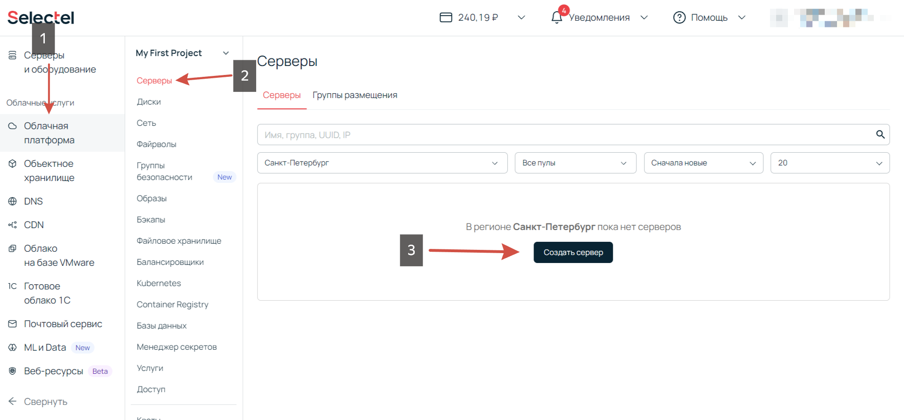
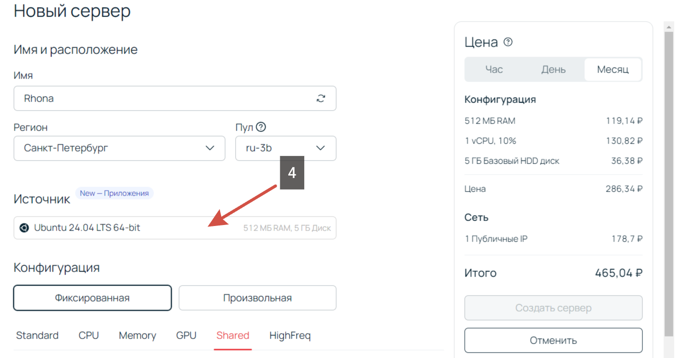
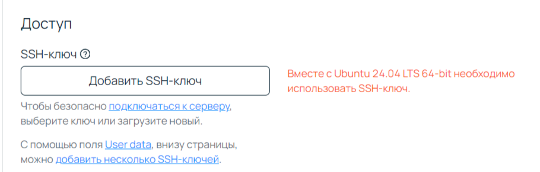
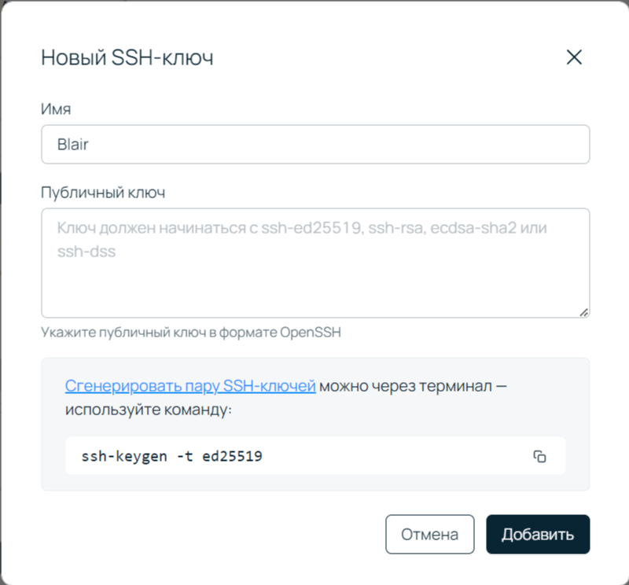
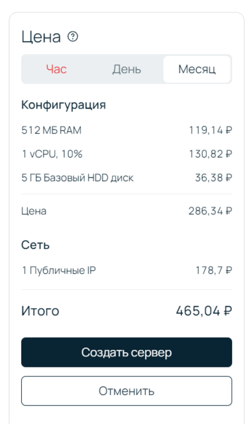
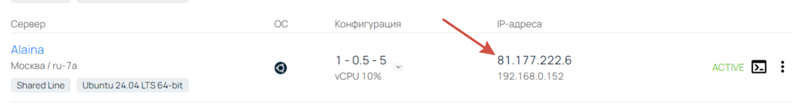
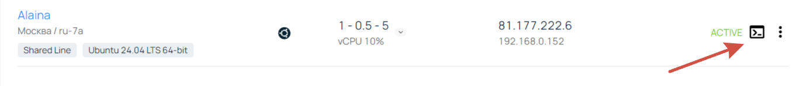

# Бот для автоворонки продаж в Telegram

### Бот для автоматизация взаимодействия с клиентами. Проводит анкетирвоание и отправляет заявку в чат менеджеров.

## 1. Создание сервера
### В примере будет использована платформа Selectel.
#### - Пройдите регистрацию, выберите подходящую конфигурацию облачного сервера.

#### - Выбираем источник - Ubuntu 24

#### - Создайте SSH ключ для подключения к серверу и добавьте

#### - Вставьте публичный ключ в поле

#### - Создаем сервер

### 2. Подключение к серверу.
#### - Подключиться к серверу можно через терминал на своем устройстве командой 'ssh root@111.222.333.444' указав свой IP сервера

#### Либо через терминал на платформе 

#### Нужно получить все обновления. Введите команду в терминале `apt update && apt dist-upgrade`
### 3. Клонирование репозитория Git 
#### Чтобы работать с git, необходимо его установить. В терминале вводим `apt install git`
#### Переходим в домашнюю дирректорию `cd /home` и создаем каталог 'bot'(можно любое имя) `mkdir bot`
#### Переходи в созданную директорию `cd bot`
#### Клонируем репозиторий с помощью команды `git clone https://github.com/gosha-popular/elvina_bot.git`
### 4. Подготовка и отправка файла окружения(.env) на сервер
#### На локальном компьютере создайте файл `.env` и запишите в него строку `BOT_TOKEN=Ваш токен`.
#### Замените "Ваш токен" на токен полученый у [Отца всех ботов](https://t.me/BotFather)
#### Отправить этот файл можно прописав команду в терминале `scp /<путь_до_папки_с_файлом_.env>/.env root@111.222.333.444:/<путь_до_папки_с_кодом_бота>` (Поменяйте IP на свой. Пример: `scp C:/user/bot/.env root@111.222.333.444:/home/bot/elvina_bot`)
#### Зайдите на сервер, перейдите в директорию бота (`cd /home/bot/elvina_bot`) и введите команду `ls -a`
#### Среди списка файлов вы должны увидеть `.env` - значит все успешно.
### 5. Создание виртуального окружения
#### Подключаемся к серверу и выполняем команду `apt install python3.12-venv` (версия python должна соответствовать установленной, проверить можно командой `python3 -V`)
#### Переходим в папку проекта `cd /home/bot/elvina_bot` и создаем виртуальное окружение `python3 -m venv venv`. Активируем его `source venv/bin/activate`
#### Убеждаемся, что мы в виртуальном окружении. Перед командной строкой в скобках должно появиться название виртуального окружения. Пример: `(venv) root@name:`
#### Устанавливаем менеджер пакетов `apt install python3-pip`
#### Устанавливаем зависимости `pip install -r requirements.txt`
### 6. Запуск бота
#### Для запуска введите в терминал `python3 main.py`
#### Рано радоваться, этот запуск для проверки. Можете написать боту и проверить, что он работает.
### 7. Создаем активную сессию для непрерывной работы бота и автозапуск при перезагрузке сервера.
#### Подключаемся к серверу (снова) `root@111.222.333.444`(свой IP)
#### Мы находимся в директории `home`, нам надо на уровень ниже `cd /.`
#### Теперь заходим `cd /etc/systemd/system/`
#### Создаем файл `sudo nano FSM_example_bot.service`
#### В него вставляем следующие строки:
`[Unit]`  
`Description=elvina_bot`  
`After=syslog.target`  
`After=network.target`  

`[Service]`  
`Type=simple`  
`User=root`  
`WorkingDirectory=/home/bot/elvina_bot`  
`ExecStart=/home/bot/elvina_bot/venv/python3 /home/bot/elvina_bot/main.py`  
`Restart=always`  

`[Install]`  
`WantedBy=multi-user.target`  

#### Сохраняем файл сочетанием клавиш `CTRL + X`
#### Перезагружаем systemd. `sudo systemctl daemon-reload`
#### Запускаем сервис командами `sudo systemctl enable elvina_bot` и `sudo systemctl start elvina_bot`
## Готово
